# Evidências de funcionamento

Comprovação prática dos requisitos do bloco 1, demonstrados pelo front-end da aplicação.

Aplicação publicada: https://projeto-politicas-seguranca.onrender.com

Check-list dos requisitos: [checklist.md](checklist.md)

---

## Telas da aplicação

Página inicial:

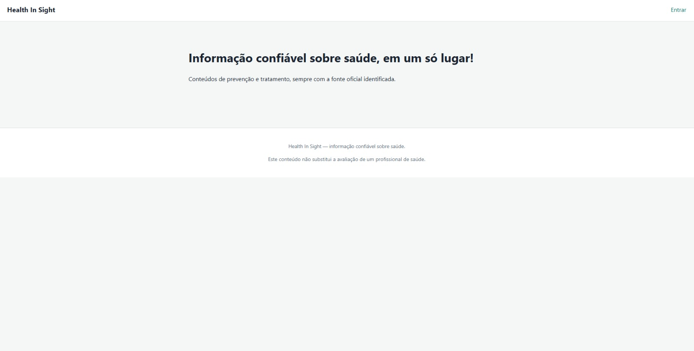

Criação de conta:

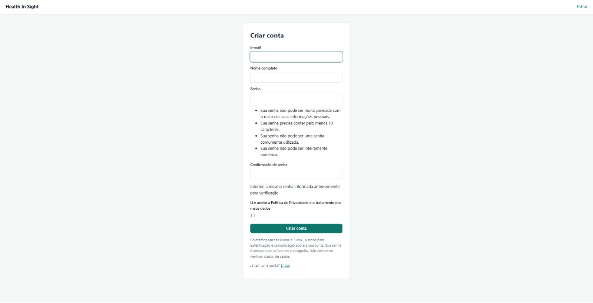

Entrada com e-mail e senha:

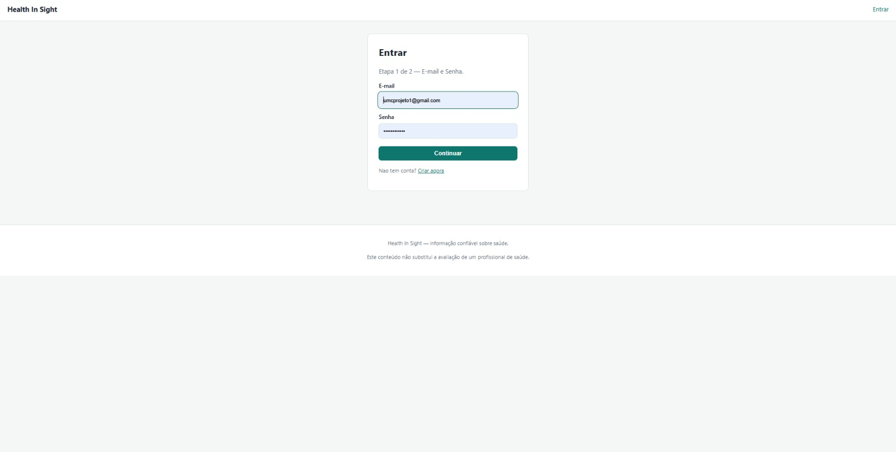

---

## 1.1, 1.3 e 1.4 — Hash Argon2id, salt único e armazenamento

Consulta à tabela de usuários no banco de dados.

**O que a imagem comprova:**

- o prefixo `argon2$argon2id$` mostra o algoritmo em uso (requisito 1.1)
- o trecho `m=65536,t=3,p=2` mostra os parâmetros de custo configurados (1.2)
- contas diferentes têm hashes completamente diferentes, porque o salt é gerado por senha (requisito 1.3)
- algoritmo, parâmetros, salt e hash ficam gravados no mesmo campo, no formato PHC (requisito 1.4)

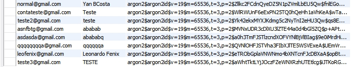

---

## Validação de senha no cadastro

Tentativa de cadastro com a senha `123456`.

**O que a imagem comprova:** a aplicação recusa apresentando três motivos ao mesmo tempo — senha curta demais, senha comum demais e senha inteiramente numérica. São os validadores configurados em `AUTH_PASSWORD_VALIDATORS`, incluindo o mínimo de 10 caracteres.

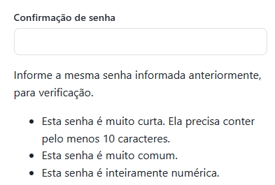

---

## 1.5 — Verificação em duas etapas implementada

Tela de ativação, com o QR Code lido pelo aplicativo autenticador.

**O que a imagem comprova:** o segredo é gerado e apresentado em tela. O dispositivo nasce como não confirmado e só passa a valer depois que a pessoa digita um código válido, o que evita que alguém fique trancado fora da própria conta.

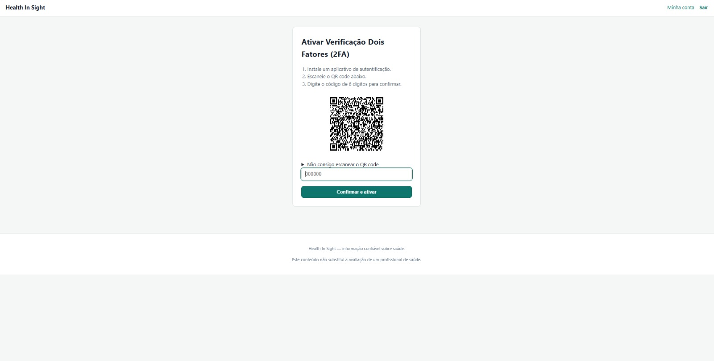

Perfil com a verificação ativa:

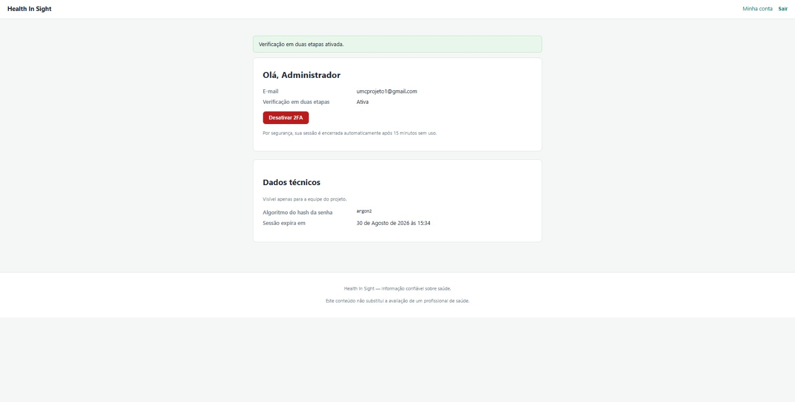

Perfil com a verificação desativada:

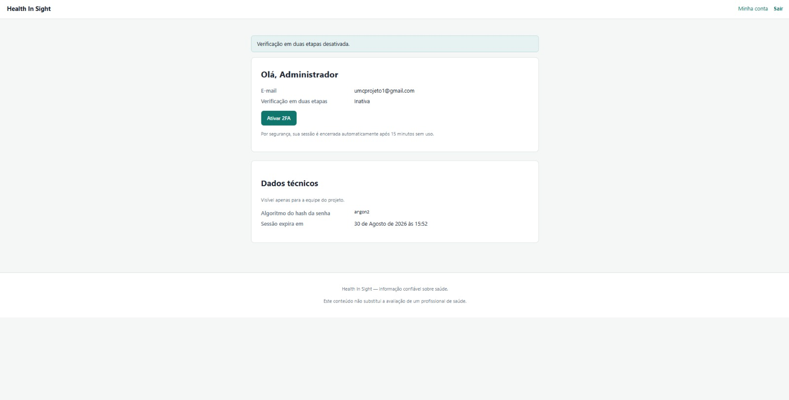

---

## 1.6 — Validação do 2FA após a autenticação primária

Este é o item central do bloco: **acertar a senha não cria sessão**.

Após informar e-mail e senha corretos em uma conta com verificação ativa, a aplicação para nesta tela.

**O que a imagem comprova:** a função `login()` do Django ainda não foi chamada neste momento. Não existe usuário autenticado, apenas uma marcação temporária de 5 minutos na sessão anônima. Quem tem a senha e não tem o celular não entra.

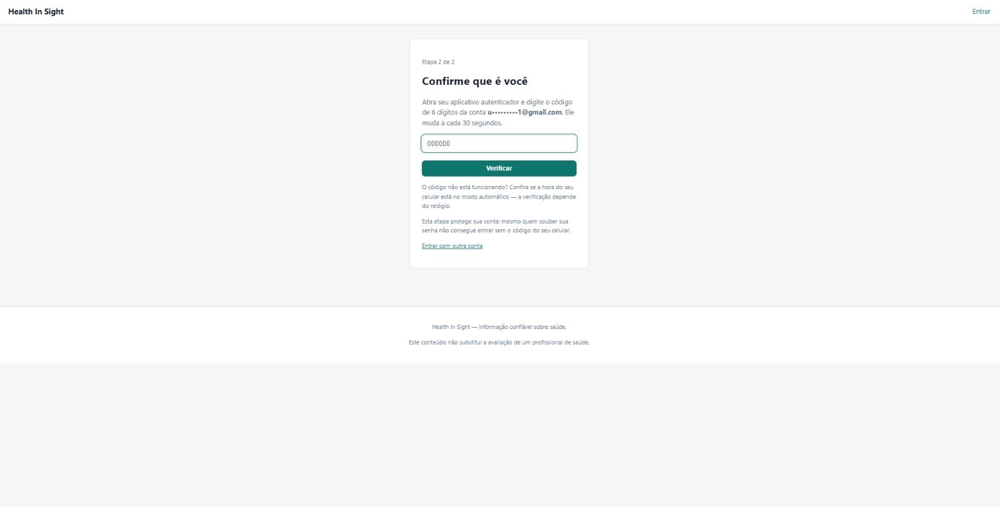

---

## 1.9 e 1.10 — Sessão com expiração e invalidação no logout

Configuração aplicada em `config/settings.py`:

```python
SESSION_COOKIE_AGE = 900            # 15 minutos
SESSION_SAVE_EVERY_REQUEST = True   # expiração deslizante
SESSION_EXPIRE_AT_BROWSER_CLOSE = True
SESSION_COOKIE_HTTPONLY = True
SESSION_COOKIE_SAMESITE = "Lax"
```

O prazo é de inatividade e se renova a cada requisição, então quem está navegando não é desconectado. No logout, o registro da sessão é removido do banco de dados, e não apenas o cookie do navegador — um cookie copiado antes do logout deixa de funcionar.

Comprovação automatizada em `apps/accounts/tests.py`, nos testes `test_sessao_expira_em_quinze_minutos` e `test_logout_apaga_a_sessao_do_banco`.

---

## 1.11 — Proteção contra força bruta

Tela apresentada na sexta tentativa, após cinco senhas incorretas.

**O que a imagem comprova:** o acesso é bloqueado por 5 minutos, com resposta HTTP 429. O bloqueio vale para a combinação de conta e endereço de rede, e não apenas para a conta — bloquear só pelo e-mail permitiria que qualquer pessoa travasse a conta de outra de propósito.

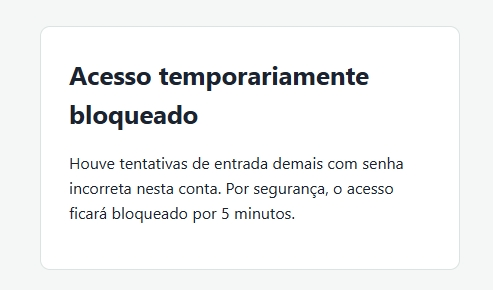

---

## 1.8 — Testes automatizados

```
python manage.py test apps.accounts
```

**O que a imagem comprova:** os 17 testes passam. No meio da saída aparecem os registros do django-axes contabilizando as cinco falhas e aplicando o bloqueio, o que evidencia o requisito 1.11 em execução.

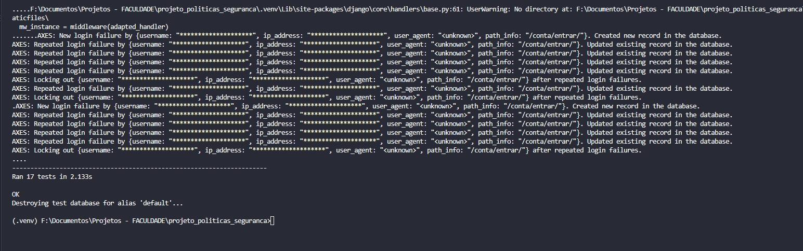

| Grupo de testes | Quantidade | Requisitos cobertos |
|---|---|---|
| `ArmazenamentoDeSenhaTests` | 5 | 1.1, 1.2, 1.3, 1.4 |
| `DuasEtapasTests` | 4 | 1.5, 1.6 |
| `SessaoTests` | 3 | 1.9, 1.10 |
| `ForcaBrutaTests` | 2 | 1.11 |
| `CadastroTests` | 3 | 1.1 e consentimento |

---

## Comunicação protegida por TLS

Aplicação publicada, acessada pelo navegador.

**O que a imagem comprova:** conexão em HTTPS com certificado válido. O acesso por HTTP é redirecionado automaticamente e a aplicação envia o cabeçalho HSTS em produção.

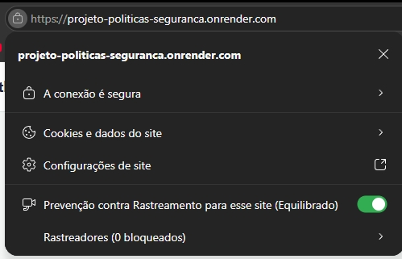
